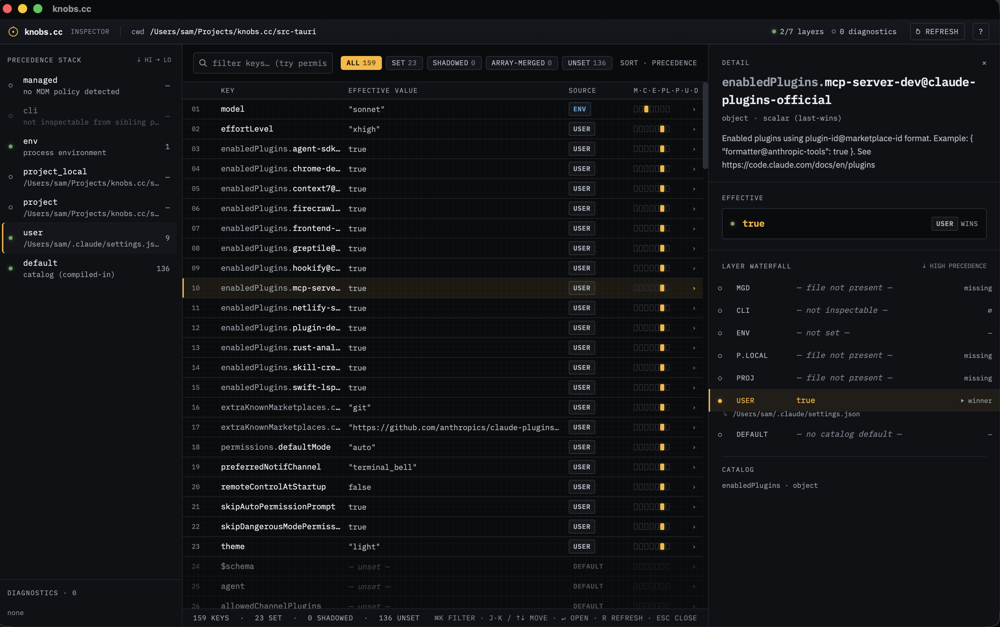
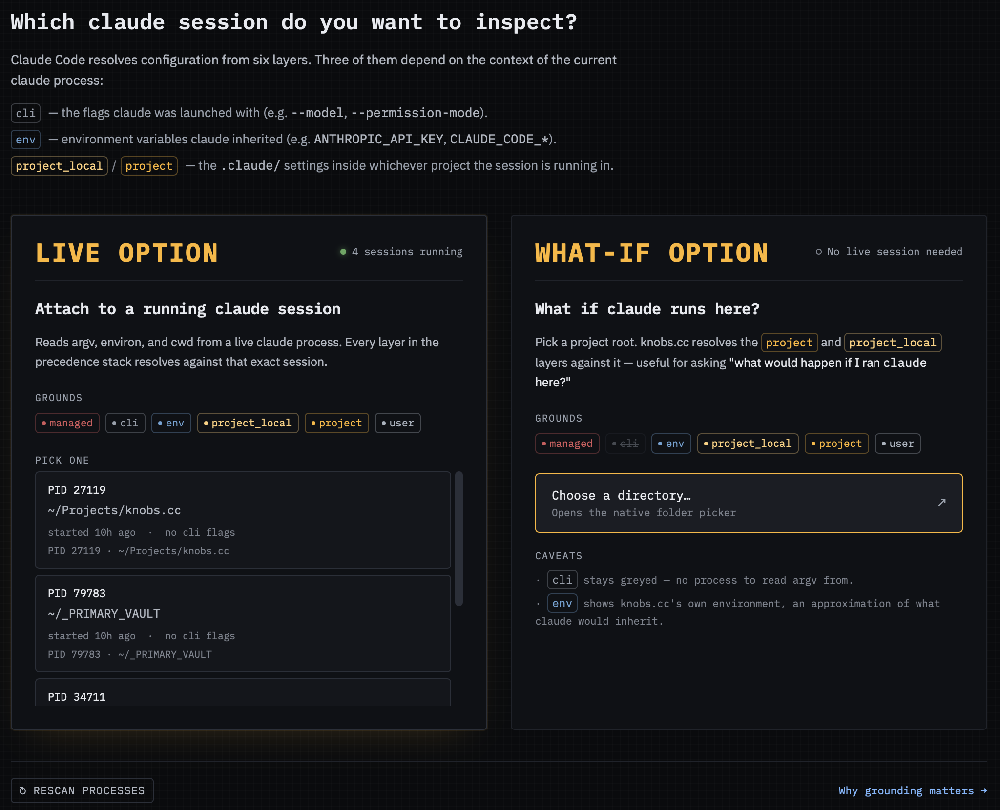

# knobs.cc

A local desktop inspector for every knob Claude Code gives you — where it lives, what it's set to, and which layer wins.



## Status

**Pre-release.** The read-only inspector runs end-to-end via
`npm run tauri dev`. No signed installer or auto-update yet.

## Premise

Claude Code has a sprawling configuration surface: settings files
(`~/.claude/settings.json`, project `.claude/settings.json`, local
overrides, enterprise-managed), environment variables, permission
modes, hooks, slash commands, MCP servers, plugins, skills, subagents,
memory files, keybindings, statusline, IDE integrations. Discovering
what's available, what's set in the current environment, and where
each value comes from (global vs project vs env var vs default) is
hard.

knobs.cc lays it all out in one place:

- What Claude Code **can** be configured with
- What **is** configured for a specific session
- **Where** each value is coming from (user / project / local /
  managed / env var / CLI flag / default)

The inspector grounds against a running `claude` process you pick
from the topbar: it reads that session's cwd, argv, and environ to
resolve the project, cli, and env layers honestly. If no claude is
running, point the inspector at a project directory and the file
layers resolve against it.

Live updates are wired in: when a watched settings file changes on
disk the snapshot refreshes automatically.

## Positioning

- **Audience.** Claude Code power users and devs setting up teams.
- **Form.** Tauri 2 desktop app — a graphical local inspector with a
  TypeScript/Vite frontend and a narrow Rust backend for filesystem
  and env reads.
- **Relationship to Anthropic.** Third-party, community-built. Not
  "Claude-" prefixed, not endorsed.
- **Distribution.** OSS desktop installers via Tauri 2 (DMG / macOS
  Application Bundle, Windows Installer (.msi / NSIS),
  AppImage / Debian / RPM). Signing, notarization, and auto-update
  come after the first signed build.
- **v1 scope.** Read-only inspection only. Editing settings through
  the app is out of scope for v1.

## Repo layout

Three coordinated surfaces:

- **The Tauri 2 app.** `src/` (React/Vite/TypeScript Inspector UI) and
  `src-tauri/` (Rust backend with the read-only `read_settings_layers`,
  `read_catalog`, `read_shell_env_vars`, and `read_runtime_layer`
  Tauri commands). Seven settings layers (managed / cli / env /
  project_local / project / user / default), per-leaf provenance,
  per-element waterfall for array-merged fields like
  `permissions.allow`, and a session picker that reads a running
  claude process's cwd, argv, and environ so the cli + env + project
  layers resolve against the same session. The managed tier reads the
  macOS `com.anthropic.claudecode` MDM plist when present and falls
  back to the file-based source otherwise.
- **The specs.** [`spec/roadmap.md`](spec/roadmap.md) is the single
  source of truth for what's shipped vs pending. Other live specs:
  [`spec/inventory.md`](spec/inventory.md) (every Claude Code knob),
  [`spec/settings-display.md`](spec/settings-display.md) (backend
  phases), [`spec/inspector-ui.md`](spec/inspector-ui.md) (UI spec —
  visual reference at [`mocks/01-inspector.html`](mocks/01-inspector.html)),
  [`spec/catalog-sync.md`](spec/catalog-sync.md), and
  [`spec/design-notes.md`](spec/design-notes.md).
- **The catalog harness.** Eight `scripts/sync-*.js` scripts (settings,
  env-vars, hooks, sub-agents, mcp, permissions, keybindings,
  cli-reference) pull upstream JSON Schema and docs into
  `catalog/*.json`, which the app consumes through `read_catalog`.
  [`.github/workflows/catalog-drift.yml`](.github/workflows/catalog-drift.yml)
  re-runs them weekly and opens a rolling PR when content drifts.

## Running knobs.cc

```sh
npm install            # install frontend dependencies
npm run tauri dev      # launch the app in development mode
```

The frontend Vite dev server runs on port 1420 (fixed). The Rust
backend is compiled on the fly by `tauri dev`; changes to
`src-tauri/` are picked up automatically.

```sh
npm run build          # type-check + build the frontend
npm run tauri build    # build a native installer (DMG / .msi / AppImage)
```

## Demo scenarios

Seven self-contained project directories under [`tests/`](tests/) exercise
specific inspector features — precedence cascades, array merging across
layers, env-layer projection, the EnvVarsPanel, the CLI/attach flow, and
the hooks drawer + details modal. Each has its own `README.md` with the exact launch command (some
plain `claude`, some prepending env vars, one with `--model`) and what
to look for in the app. Start with
[`tests/01-minimal/`](tests/01-minimal/) and walk up.



## Deep dives

Mid-level technical explanations of non-obvious mechanics live in
[`docs/deep_dives.md`](docs/deep_dives.md) — currently covers how
env vars shadow settings keys through the synthesized env layer.

## Test suites

Three suites live in this repo:

```sh
npm run test:unit                    # vitest run — frontend (src/)
npm run test:unit:watch              # vitest watch mode
npm test                             # node:test on scripts/sync-*.test.js
npm run test:coverage                # node:test with coverage report
(cd src-tauri && cargo test --lib)   # Rust backend unit tests
```

`main()` in the catalog-sync scripts (network fetch + filesystem
write) is intentionally excluded from coverage.

CI runs the same suites on Linux, macOS, and Windows for every push
and pull request — see [`.github/workflows/ci.yml`](.github/workflows/ci.yml).

## Contributing

Early days — not accepting code PRs yet. If you've spotted a Claude
Code knob the inventory is missing or has wrong, please open an
issue. See [`CONTRIBUTING.md`](CONTRIBUTING.md).

## License

MIT. See [`LICENSE`](LICENSE).
