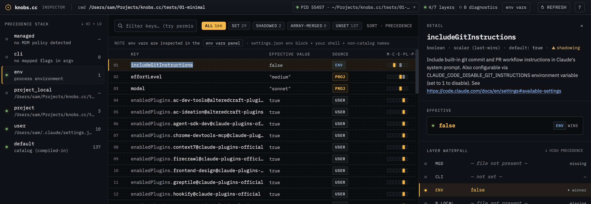

# 01 — Minimal baseline

**Demonstrates:** a single active settings layer, catalog cross-reference in
the drawer, and clean "everything else is unset" rendering.

## Run Claude command

```shell
claude
```

No env vars, no CLI flags — only `.claude/settings.json` is in play.

**Alternate** — re-run with one env var set to demonstrate env-layer
shadowing on the same scenario without changing any files:

```shell
CLAUDE_CODE_DISABLE_GIT_INSTRUCTIONS=1 claude
```

`CLAUDE_CODE_DISABLE_GIT_INSTRUCTIONS=1` projects through
`catalog/env-settings-map.json` as `includeGitInstructions: false`,
shadowing the `true` set in `.claude/settings.json`. Attach knobs.cc to
this claude and the `includeGitInstructions` row source flips from
`PROJ` to `ENV`, with the project value shown shadowed in the layer
waterfall.



## What's set

`.claude/settings.json` defines three top-level keys:

- `model: "sonnet"`
- `effortLevel: "medium"`
- `includeGitInstructions: true`

That's it — no local override, no `env` block, no permissions.

## How to demo

1. Open knobs.cc.
2. SessionPill → "Choose a project directory" → pick `tests/01-minimal/`.
   (No need to start claude — pure file-based read.)
3. Look at the **PRECEDENCE STACK** rail on the left:
   - `project` row shows count 3, status dot active.
   - Every other layer shows count 0, dimmed.
4. In the settings list, click `model`:
   - Drawer opens with the value (`"sonnet"`), provenance chip
     (`project`), and the catalog description / type / default pulled
     from upstream docs.

## Talking points

- The catalog cross-reference is what makes the drawer useful — every
  setting links back to its documented purpose and default.
- Layers with no contribution are still visible in the rail so users
  know the precedence order at a glance, not just what's active.
- The **alternate command** is a one-keystroke way to show env-layer
  shadowing without leaving the scenario: same files, same drawer
  cross-ref, but the source chip flips and the waterfall lights up.
  Great as a "...and now watch this" moment.
