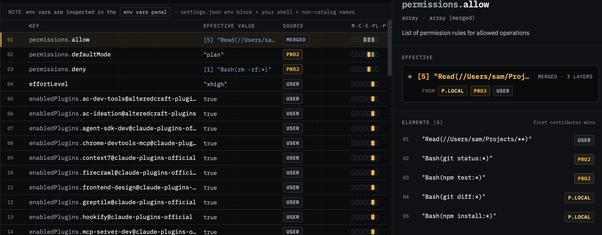

# 03 — Array merge with per-element provenance

**Demonstrates:** the most subtle precedence behaviour in Claude Code —
`permissions.allow` and `permissions.deny` *merge* across layers rather
than overriding. knobs.cc surfaces per-element provenance so you can see
which layer contributed each individual entry.

## Run Claude command

```shell
claude
```

No env vars, no CLI flags — the merge is purely a file-layer behaviour.

## What's set

`.claude/settings.json` (project):

```json
"permissions": {
  "allow": ["Bash(git status:*)", "Bash(npm test:*)"],
  "deny":  ["Bash(rm -rf:*)"],
  "defaultMode": "plan"
}
```

`.claude/settings.local.json` (project_local):

```json
"permissions": {
  "allow": ["Bash(git diff:*)", "Bash(npm install:*)"]
}
```

The two `allow` arrays don't replace each other — they concatenate
(with dedup). `defaultMode` doesn't get touched by local, so it stays
at the project value.



## How to demo

1. SessionPill → path-picker → pick `tests/03-array-merge/`.
2. Rail: both `project_local` and `project` active.
3. Settings list — find the `permissions.allow` row:
   - Value shows **4 entries**, not 2.
   - Row badge: `array-merged` chip.
4. Click into `permissions.allow` → drawer shows the array with each
   element annotated by its source layer:
   - `Bash(git status:*)` — project
   - `Bash(npm test:*)` — project
   - `Bash(git diff:*)` — project_local
   - `Bash(npm install:*)` — project_local

## Talking points

- Most settings tools treat the "winning" layer as monolithic. Arrays
  break that model — a single key can be co-authored by multiple
  layers, and users genuinely need to see which entry came from where.
- The merge order matters: project_local entries appear after project,
  matching the documented Claude Code behaviour.
- `permissions.deny` only has one entry from project — it's still a
  merged field, just with one contributor. The chip is still
  applicable; we surface the merge semantics even when the merge is
  degenerate.
