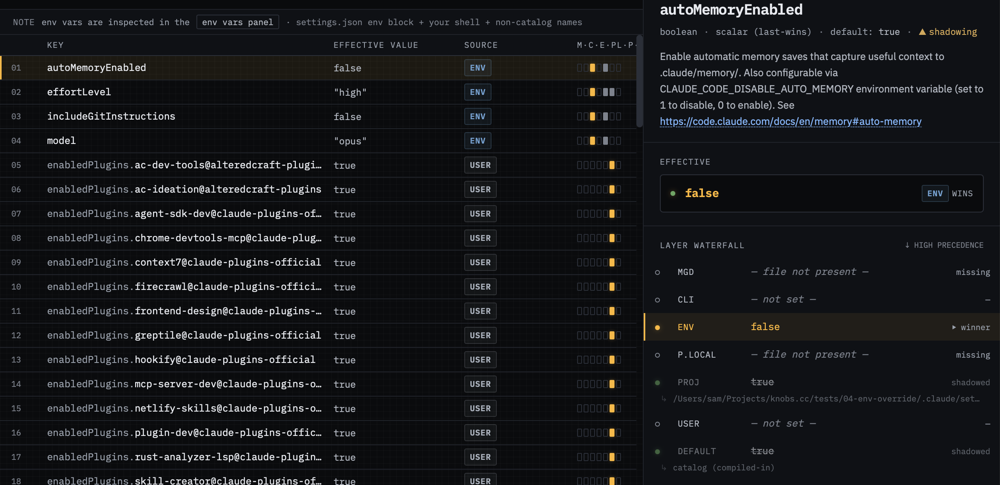

# 04 — Env layer beats settings

**Demonstrates:** the `env` precedence layer projecting OS env vars onto
settings keys via `catalog/env-settings-map.json`. Today's audit landed
this at 9 mapped pairs; this scenario activates several at once.

## Run Claude command

```shell
ANTHROPIC_MODEL=opus \
CLAUDE_CODE_EFFORT_LEVEL=high \
CLAUDE_CODE_DISABLE_AUTO_MEMORY=1 \
CLAUDE_CODE_DISABLE_GIT_INSTRUCTIONS=1 \
claude
```

Four mapped env vars set in the shell, each overriding the equivalent
key in `.claude/settings.json`. Leave claude running so knobs.cc can
attach to its environ.

## What's set

`.claude/settings.json` (project):

- `model: "sonnet"`
- `effortLevel: "low"`
- `autoMemoryEnabled: true`
- `includeGitInstructions: true`

We'll override all four from the shell environment.



## How to demo

1. `cd tests/04-env-override` and run the command above. Claude doesn't
   need to do anything — it just needs to be running. Type nothing and
   leave it open.

2. Open knobs.cc. SessionPill picks up the running claude (1 process).
   Click it to attach.

3. Rail: `env` layer now active with count 4. `project` still shows 4
   contributions, but they're shadowed.

4. Settings list — each of the four overridden rows:
   - `model`: value `"opus"`, provenance `env`. Drawer waterfall shows
     `project` underneath with `"sonnet"` struck through.
   - `effortLevel`: `"high"` from env, `"low"` shadowed.
   - `autoMemoryEnabled`: `false` from env (note the **inversion** —
     `CLAUDE_CODE_DISABLE_AUTO_MEMORY=1` projects to
     `autoMemoryEnabled: false`), `true` shadowed.
   - `includeGitInstructions`: `false` from env (also inverted),
     `true` shadowed.

5. Detach (SessionPill → "Choose a project directory" instead) and
   confirm the env layer drops back to count 0, project takes over —
   demonstrates that env is sourced from the *attached* claude's
   environ, not knobs.cc's own.

## Talking points

- The env layer is narrow by design: only 9 mapped pairs, because most
  of Claude Code's ~225 env vars don't have a settings.json equivalent
  (they're env-only knobs). For the full env-var surface, the
  **EnvVarsPanel** is the SSOT — see scenario 05.
- Inversion matters: `DISABLE_X=1` means `xEnabled: false`. Without the
  hand-curated `env-settings-map.json` we'd have no way to know that.
- This precedence layer is the answer to "I set `ANTHROPIC_MODEL` in my
  shell — why is `model` showing a different value?" Without the rail,
  that's a tab-switching scavenger hunt.
