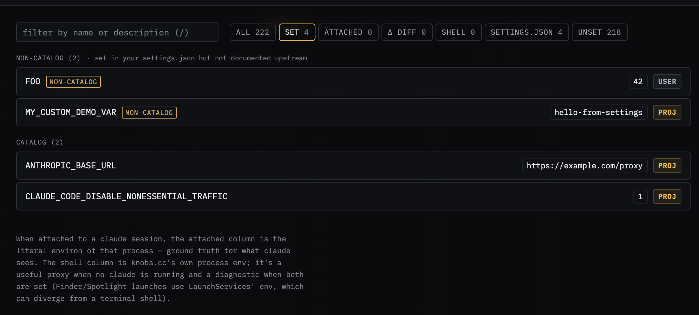

# 05 — EnvVarsPanel sourcing from settings.json `env` block

**Demonstrates:** the dedicated EnvVarsPanel as the SSOT for env-var
visibility. The settings.json `env` block contributes values to env
vars from the *settings* layer (not the OS environment), and the panel
joins those with the upstream env-var catalog.

## Run Claude command

```shell
claude
```

No env vars in the shell — the demo is about the `env` *block inside*
`.claude/settings.json`, which is a different mechanism. Knobs.cc can
inspect this scenario purely from the file (no need to attach).

## What's set

`.claude/settings.json` includes a top-level `env` block with a mix:

- `ANTHROPIC_BASE_URL` — cataloged var (proxy URL)
- `CLAUDE_CODE_DISABLE_NONESSENTIAL_TRAFFIC` — cataloged var
- `MY_CUSTOM_DEMO_VAR` — user-defined, not in the catalog

The inspector's settings list **skips** the `env` subtree by design —
this surface is owned end-to-end by the EnvVarsPanel.



## How to demo

1. SessionPill → path-picker → pick `tests/05-env-block/`. (No running
   claude needed.)

2. **Rail:** project layer is active, count includes the `env` block
   contribution. But the inspector list does **not** show `env.*` rows
   (filtered out by `src/lib/rows.ts`).

3. **Click the env-vars pill in the topbar** to open the EnvVarsPanel.
   This is a takeover modal — the SSOT for env-var state.

4. Filter chips: switch to **`settings.json`** to scope to vars
   contributed by settings files:
   - `ANTHROPIC_BASE_URL` row: value `"https://example.com/proxy"`,
     source `settings (project)`. Catalog description and default
     visible below.
   - `CLAUDE_CODE_DISABLE_NONESSENTIAL_TRAFFIC`: value `"1"`,
     source `settings (project)`.
   - `MY_CUSTOM_DEMO_VAR`: value `"hello-from-settings"`, source
     `settings (project)`, appears in the **user-defined** subsection
     (no catalog match).

5. Switch the filter to **`attached`** to see env vars from the running
   claude's environ (if one is attached). When nothing is attached,
   shell-env-vars from knobs.cc's own process fill in as a best-effort
   proxy with a status note.

## Talking points

- The `env` block in settings.json is itself a layered concern — same
  precedence rules (project_local beats project beats user). The
  panel's source chip surfaces which layer contributed each var.
- Catalog vs user-defined is a real distinction: 220+ documented vars
  get descriptions, defaults, and (where sensitive) masking; arbitrary
  user-defined vars still show but without that metadata. The panel
  doesn't pretend to know what `MY_CUSTOM_DEMO_VAR` is for.
- Splitting the precedence-resolution-for-settings-keys story (rail)
  from the env-var-state story (panel) is intentional — see
  `spec/settings-display.md` §"Sibling surfaces". Trying to cram both
  into a single tree would lose information either way.
