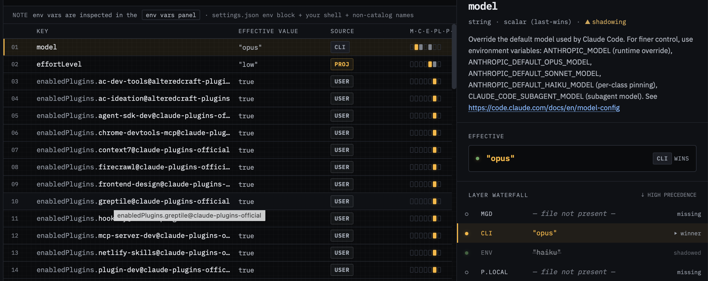

# 06 — CLI argv layer (attach mode)

**Demonstrates:** the highest non-managed precedence layer — command-line
arguments passed to `claude` — overriding env *and* settings. Requires
attach mode because argv only exists for a running process.

## Run Claude command

```shell
ANTHROPIC_MODEL=haiku claude --model opus
```

Three different values for `model` are now in play simultaneously:
`"sonnet"` from settings.json, `"haiku"` from env, `"opus"` from cli.
The cli layer should win.

## What's set

`.claude/settings.json` (project):

- `model: "sonnet"`
- `effortLevel: "low"`



## How to demo

1. `cd tests/06-cli-attach` and run the command above. Leave claude
   running. Three different values for `model` are now in play:
   - `settings.json`: `"sonnet"`
   - env (`ANTHROPIC_MODEL`): `"haiku"`
   - cli (`--model`): `"opus"`

2. In knobs.cc, attach to the running process via SessionPill.

3. **Rail:** three layers active — `cli`, `env`, `project`. Each shows
   a count, all dotted.

4. Click `model` in the settings list. The drawer waterfall is the
   marquee shot:
   - `cli`: `"opus"` ← **winner**
   - `env`: `"haiku"` ← shadowed
   - `project`: `"sonnet"` ← shadowed

5. `effortLevel` row: provenance `project` (the cli flag didn't touch
   it). Demonstrates that cli only contributes to keys it actually
   sets — it doesn't blanket-shadow lower layers.

## Talking points

- The cli layer requires attach mode because there's no other way to
  know what argv was passed. This is one of the main motivations for
  attach mode existing.
- Mapping cli flags to settings keys is *also* hand-curated, in
  `catalog/cli-settings-map.json` — parallel to today's env-settings-map
  work. Same root-cause drift problem (tracked in issue #16 for env;
  cli has the same shape).
- The three-layer waterfall on `model` is the single best demo of the
  precedence rail's value — replaces "I have to grep three places to
  know what's actually running."

## Cleanup

Ctrl+D out of claude, or kill the process. The cli/env layer counts
will drop back to 0 in knobs.cc once the attached process exits.
